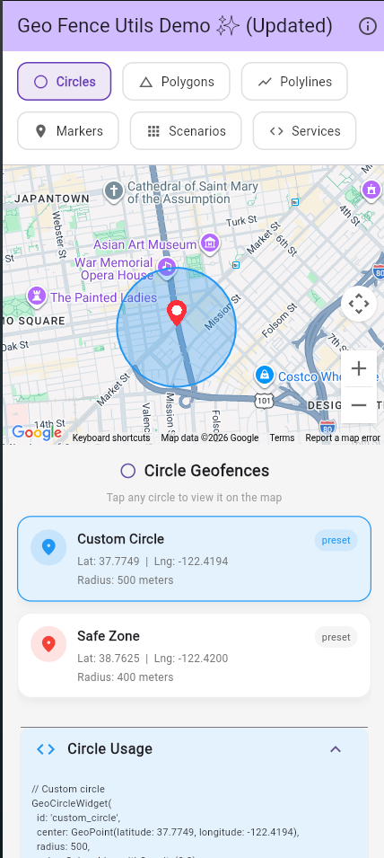
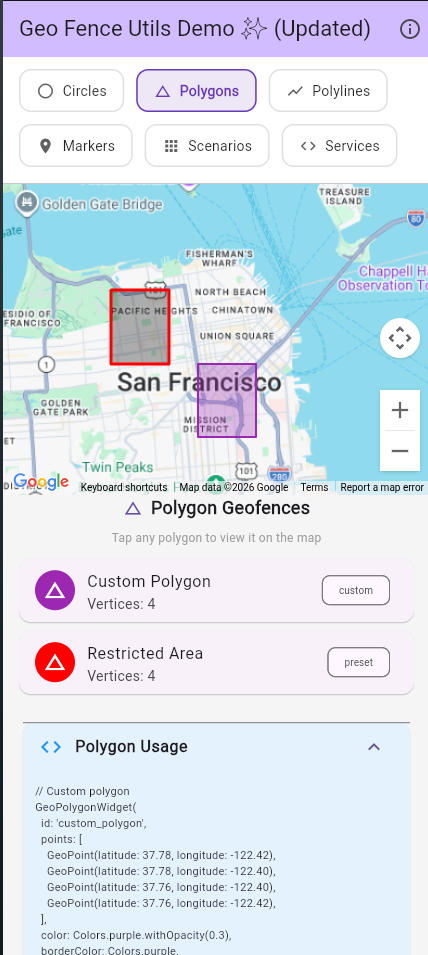
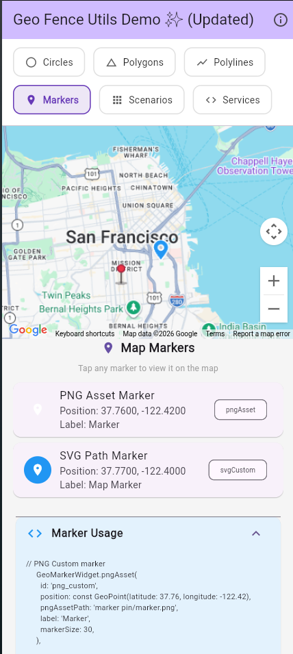

<div align="center">

# geo_fence_utils

**A production-ready Dart package for geofence calculations**

[](https://pub.dev/packages/geo_fence_utils)
[](LICENSE)
[](https://dart.dev)
[](TEST_COVERAGE.md)
[](TEST_COVERAGE.md)

</div>

---

## What is geo_fence_utils?

**geo_fence_utils** is a comprehensive Flutter/Dart package designed for handling geofence calculations and location-based operations. It provides utilities for calculating distances between geographic points, detecting whether points lie within circular or polygonal boundaries, and performing batch operations on multiple locations efficiently.

This package is ideal for developers building location-aware applications without wanting to deal with the complexities of geographic calculations.

---

## Screenshots

<p align="center">
  
  
  
</p>

<p align="center">
  <b>Circle Geofence</b> &nbsp;&nbsp;&nbsp;&nbsp;&nbsp;&nbsp;&nbsp;&nbsp;
  <b>Polygon Geofence</b> &nbsp;&nbsp;&nbsp;&nbsp;&nbsp;&nbsp;&nbsp;&nbsp;
  <b>Custom Markers</b>
</p>

---

## Purpose

The primary purpose of this package is to simplify geospatial calculations in Flutter and Dart applications. It handles the complex mathematics behind geographic operations, allowing you to focus on building your application logic rather than implementing coordinate geometry algorithms.

### Common Use Cases

- **Delivery & Logistics**: Determine if delivery addresses fall within service areas
- **Location-Based Notifications**: Trigger alerts when users enter or exit specific zones
- **Asset Tracking**: Monitor vehicles, equipment, or inventory within designated boundaries
- **Gaming**: Create location-based games with virtual boundaries
- **Security Systems**: Alert when devices leave authorized areas
- **Attendance Systems**: Check if users are within allowed locations for check-in
- **Ride-Sharing**: Match passengers with drivers within certain radius
- **Marketing**: Send location-based promotional offers to users in specific areas

---

## Key Features

| Feature | Description |
|---------|-------------|
| **Accurate Distance Calculation** | Uses Haversine formula with ~0.5% accuracy for great-circle distances |
| **Circle Geofence** | Point-in-circle detection with radius-based filtering |
| **Polygon Geofence** | Ray casting algorithm for complex polygon shapes |
| **Batch Operations** | Efficiently process multiple points in single operations |
| **Interactive Map Widget** | Display geofences on Flutter Map or Google Maps |
| **Custom Markers** | Support for PNG and SVG markers with customizable styles |
| **Pure Dart** | No native dependencies - works on all platforms (iOS, Android, Web, Desktop) |
| **Type Safe** | Full null safety support with strong typing |
| **Well Tested** | 96% code coverage with 187 passing tests |
| **Easy to Use** | Simple, intuitive API with clear documentation |

---

## Installation

Add the package to your `pubspec.yaml`:

```yaml
dependencies:
  geo_fence_utils: ^1.0.0
```

Then run:

```bash
flutter pub get
```

Or use the Flutter CLI:

```bash
flutter pub add geo_fence_utils
```

---

## Package Overview

### Core Models

The package provides three main data models:

- **GeoPoint**: Represents a geographic coordinate with latitude and longitude
- **GeoCircle**: Defines a circular geofence with a center point and radius
- **GeoPolygon**: Defines a polygonal geofence with multiple vertices

### Services

Three main service classes handle all operations:

- **GeoDistanceService**: Calculate distances, find closest/farthest points, sort by distance
- **GeoCircleService**: Check points inside/outside circles, calculate circle overlap
- **GeoPolygonService**: Check points inside/outside polygons, calculate area/perimeter

### Map Widgets

Interactive widgets for visualizing geofences:

- **GeoGeofenceMap**: Main map widget supporting Flutter Map and Google Maps
- **GeoCircleWidget**: Display circular geofences with customizable styles
- **GeoPolygonWidget**: Display polygonal geofences with fill patterns
- **GeoPolylineWidget**: Display routes and paths
- **GeoMarkerWidget**: Display custom PNG or SVG markers

---

## Technical Details

- **Coordinate System**: WGS 84 (GPS standard)
- **Distance Formula**: Haversine (~0.5% accuracy with spherical Earth assumption)
- **Distance Units**: Meters
- **Supported Platforms**: All (iOS, Android, Web, Windows, macOS, Linux)

---

## Performance

| Operation | Time Complexity | Notes |
|-----------|-----------------|-------|
| Distance calculation | O(1) | Constant time |
| Circle containment | O(1) | Constant time |
| Polygon containment | O(n) | Linear with polygon vertices |
| Batch filtering | O(n×m) | n points, m polygon vertices |

---

## Documentation & Resources

- **API Reference**: Full API documentation available on [pub.dev](https://pub.dev/packages/geo_fence_utils)
- **Test Coverage**: See [TEST_COVERAGE.md](TEST_COVERAGE.md) for detailed coverage information
- **Example App**: Check the `/example` directory for a complete working demonstration
- **Issues**: Report bugs or request features on [GitHub Issues](https://github.com/MEET-1008/geo_fence_utils/issues)
- **Discussions**: Join the conversation on [GitHub Discussions](https://github.com/MEET-1008/geo_fence_utils/discussions)

---

## Testing

Run the test suite:

```bash
flutter test
```

Generate coverage report:

```bash
flutter test --coverage
genhtml coverage/lcov.info -o coverage/html
```

---

## Contributing

Contributions are welcome! Please ensure:

- All tests pass
- Code follows Dart style guidelines
- New features include tests
- Documentation is updated

1. Fork the repository
2. Create your feature branch
3. Commit your changes
4. Push to the branch
5. Open a Pull Request

---

## License

This project is licensed under the MIT License - see the [LICENSE](LICENSE) file for details.

---

<div align="center">

**Built with ❤️ for the Flutter/Dart community**

</div>
